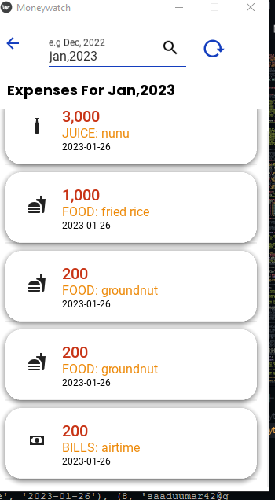
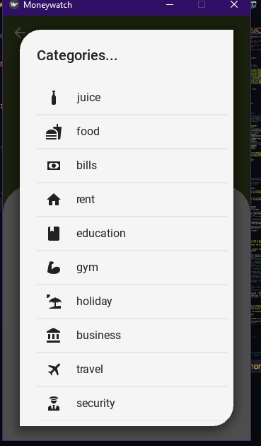
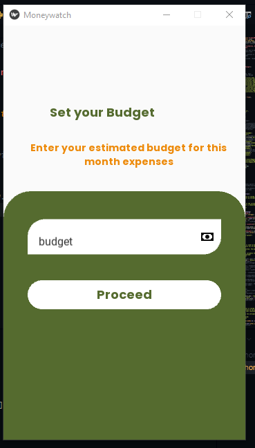
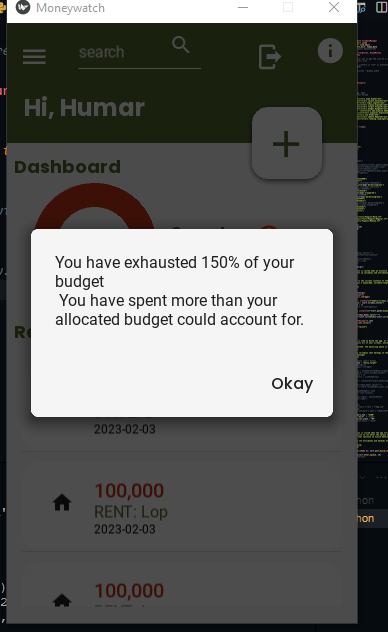
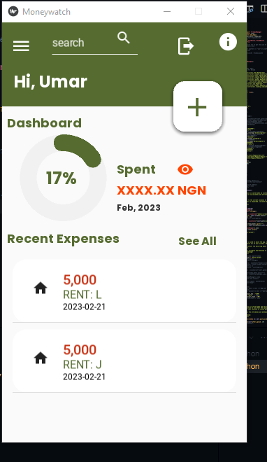
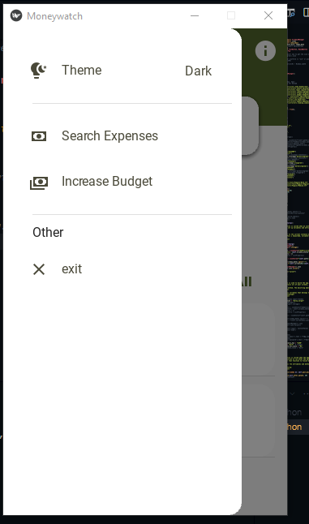
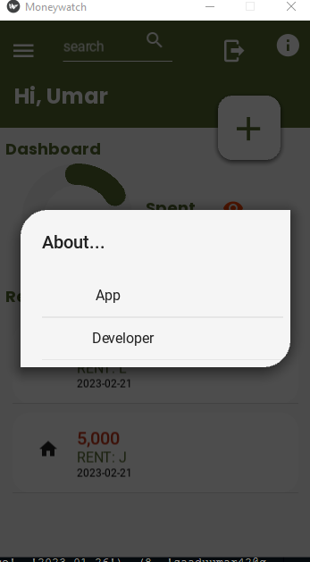
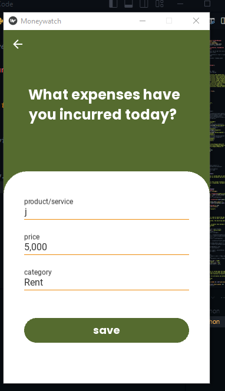
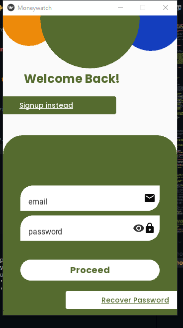

# MoneyWatch
Keeps track of all your expenses for the month and also warns you when you exceed your budget

# Built with kivy/kivymd and uses sqlite3 database
This app is available for android and the apk can be found in the Apk Directory.

# How to Use
* clone this repository by typing 'git clone https://github.com/humarr/MoneyWatch' in your terminal .
* pip install https://github.com/kivymd/KivyMD.archive/master.zip
* pip install yagmail
* pip install pyrebase4

After these, run the main.py file.

You can also download the android apk file from the apk folder.

